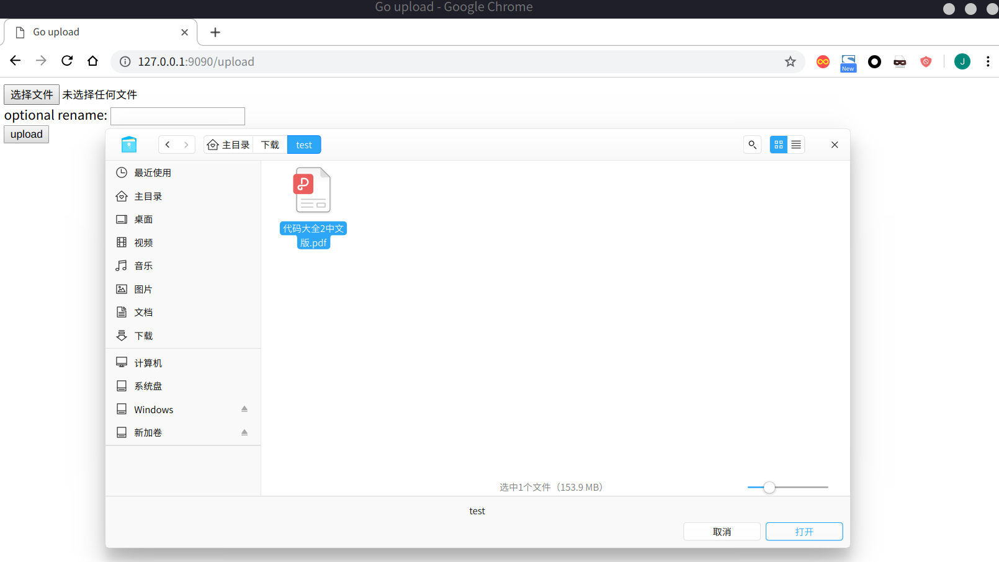
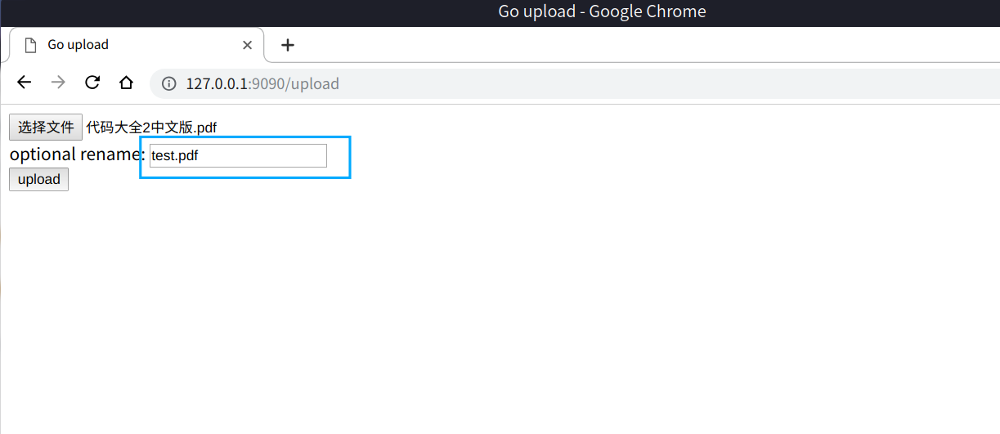
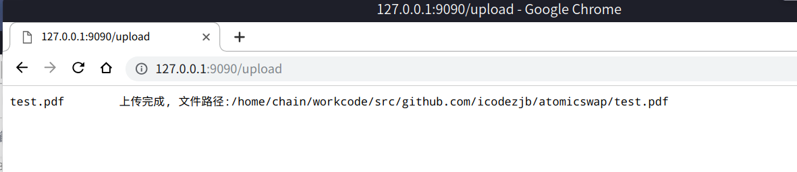
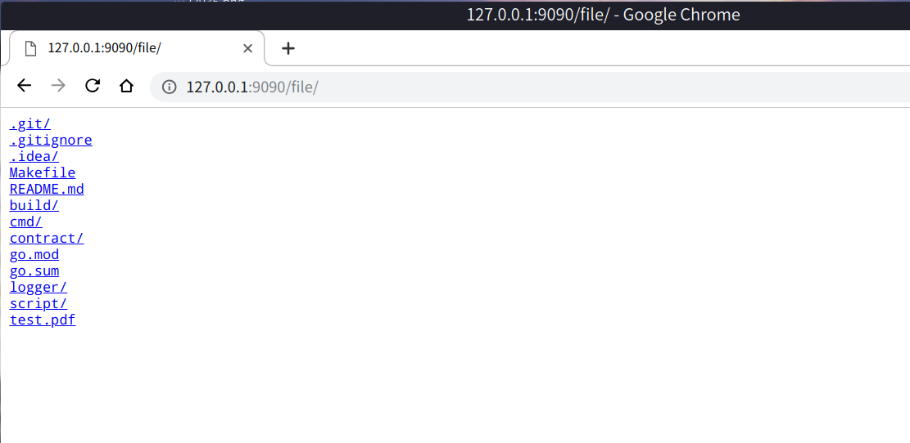
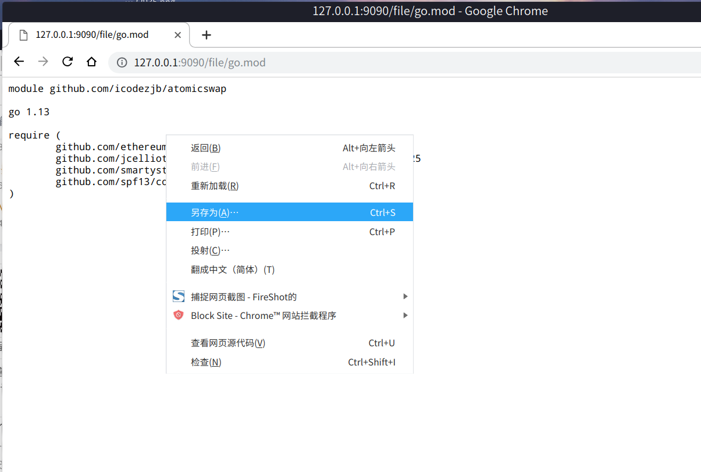
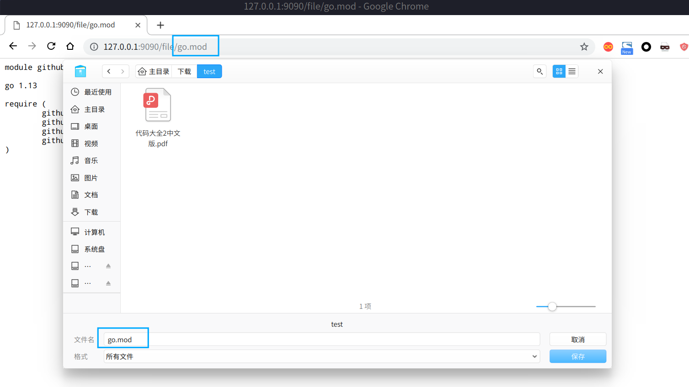

# fileserver —— 简单的基于http的“文件上传+文件浏览+文件下载”服务

###特别适合办公室环境下,局域网跨平台瞬时文件传输服务


#### 1. fileserver命令

查看帮助
```bash
$./fileserver -h
 Usage of ./fileserver:
   -dir string
     	file server data dir (default "./")
   -port string
     	port number (default "9090")

```

运行服务
```bash
$ ./fileserver -port 9000 -dir ./test
Now serving on http://192.168.9.217:9000/
```


#### 2. 命令行上传/下载

上传
```bash
$ curl -F uploadfile=@test.pdf http://127.0.0.1:9090/upload
test.pdf	上传完成, 文件路径:/home/chain/test/test.pdf
```

下载
```bash
$ curl -o test2.pdf http://127.0.0.1:9090/file/test.pdf
  % Total    % Received % Xferd  Average Speed   Time    Time     Time  Current
                                 Dload  Upload   Total   Spent    Left  Speed
100  153M  100  153M    0     0   965M      0 --:--:-- --:--:-- --:--:--  967M
```


#### 3. 浏览器上传/下载

文件服务器首页


选择上传文件


可对上传文件重命名


上传成功


查看文件


点击浏览器右键——“另存为”


选择保存目录
